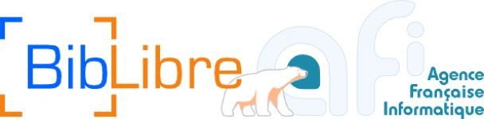
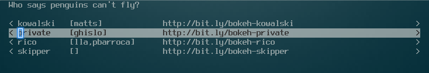
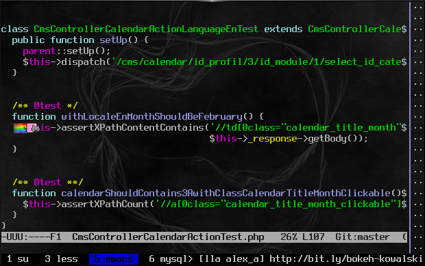
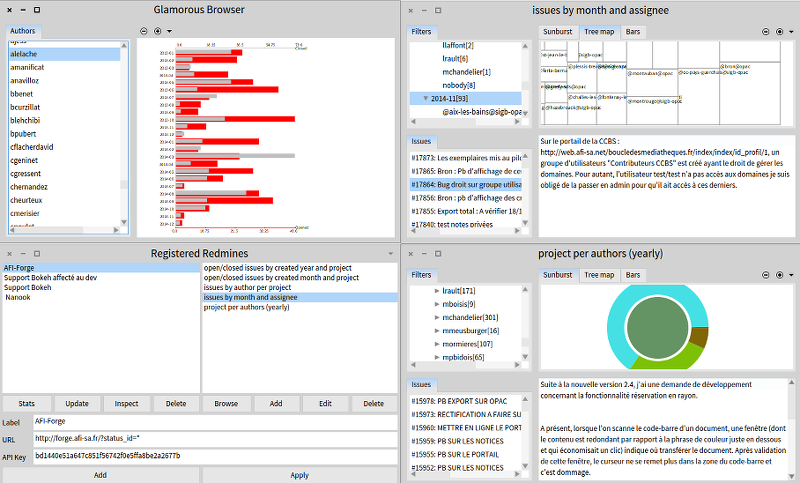
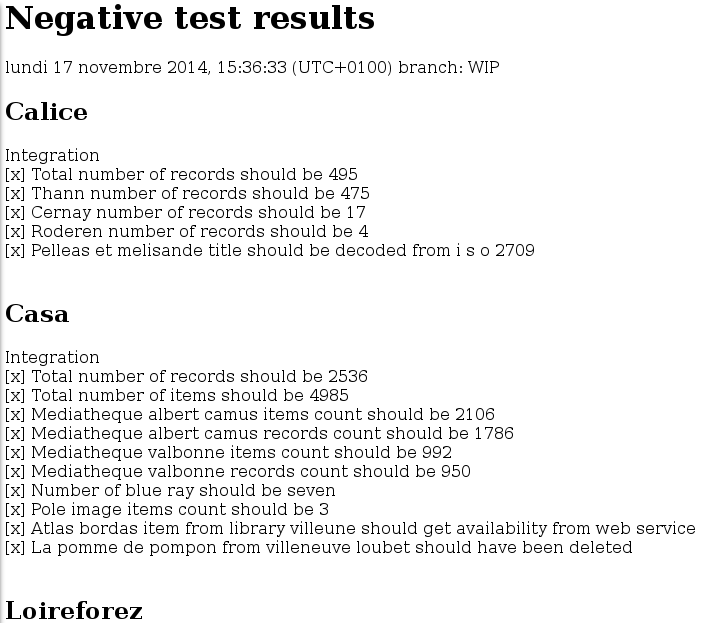
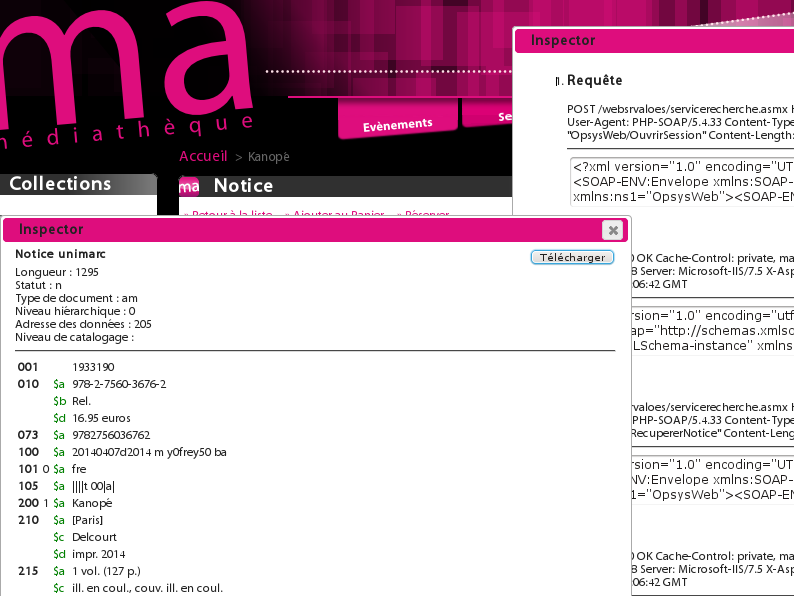

class: center, middle, white
background-image: url(img/premieredecouv.png)

# Qui a dit que les pingouins
# ne savaient pas voler ?

### N’adoptez pas d’outils ! Refusez tout process ! Créez les vôtres !

/dev/var le 19 février 2015 à Toulon

???

* Bonjour [...]
* pour votre culture, un manchot ça nage et un pingouins, ça vole
* je vais commencer par vous parler de singes et de bananes

---
class: bigger
background-image: url(img/singe_bananes.png)

# Des singes et des bananes

???

* 5 singes, une échelle et une banane en haut
* si un singe part, on arrose ceux qui restent
* quand un singe part, il se fait retenir par les autres
* au fur et à mesure on remplace les singes
* à la fin ils se retiennent, mais ils ne savent plus pourquoi.

* Remettre en cause toujours ce qui est établi
* Ce qui était efficace avant ne l'est plus aujourd'hui


---
background-image: url(img/context_2_devs_2_light.png)

# Afi-Opac en 2010...

* un portail pour les bibliothèques

* produit propriétaire d'AFI

* 1 développeur

* une installation en production

* 1 chef de projet à temps partiel


---
background-image: url(img/context_lot_2_light.png)

# ...vers  en 2015

* 

* 

* 7 Développeurs, 1 Scrummaster, 1 Product Owner

* 3 Hotliners, 3 Chefs de projet

* ~180 installations et 100 dépôts git

* itérations 2 semaines

* ~8 mises à jour des clients par mois

???
2 versions majeures + des mineures

---
class:bigger
background-image: url(img/penguin_computer.png)
# Pourquoi développons nous du logiciel (libre)?


* Passer du temps à créer et non répéter 

* Pour que nos clients satisfassent leurs utilisateurs

???

transition : notre prez est axée sur les outils, il faut bien comprendre qu'ils ne servent que de support à l'interaction

* donner de l'importance en priorité aux individus, mais ne pas en donner aucune au reste
* avant tout et de se lancer, avoir une équipe alignée et soudée qui communique !
* les outils 
 * sont là pour donner toute la place et l'efficacité à l'équipe
 * les outils vont faciliter la coopération et la communication

---
class: center,top
background-image: url(img/plan_light.png)

#  Contextualiser les prises de décisions, les processus et les outils

???

* Comment
  * Créer des outils contextuels
  * démarche non "copier/collable" (ex: TU sur entreprise)
  * Adaptation des outils et process à son contexte et non l'inverse
  * à chaque nouvelle personne qui entre ou part ou nouveau client, l'équilibre est modifié et les outils doivent s'adapter
---
class: center,middle
background-image: url(img/parachute_light.png)
# Démarche plutôt que les outils

???

* montrer le chemin emprunté pour sensibiliser / faire réagir
* adaptation ontinue
* volonté de ne pas passer du temps à re-faire, mais d'automatiser pour passer plus de temps sur la valeur ajoutée

---
class: center,top
background-image: url(img/experimenter_light.png)

# Ne pas refaire le monde qu'aux poses café, mettre en pratique par petits pas

???

* "Il faut que", "Si seulement j'avais", "c'est compliqué de", "j'ai pas le temps"
* important d'avoir un suivi pour ne pas retomber dans le travers "y a qu'à faut qu'on"


---
background-image: url(img/context_2_devs_2_light.png)
 
 # Afi-Opac en 2010...


---
background-image: url(img/pendant_ce_temps.png)
# Il s'en est passé des choses...

???

* En 2010, des besoins simples (1 dev, arrivée d'un autre dev)
* ne pas faire au delà de ce qui nous apporte de la valeur
* prise en compte du temps d'adoption, commencer simple et accessible
* ne pas mettre en place plus de choses que nécessaire (pas de capistrano, chef, puppet, ....)

* Un développeur est rejoint par un autre...

* Notre Forge est sous Redmine (gestionnaire de tickets)

* Editeur CSS accessible client

* Cosmotalk (monitoring métier des installations)

* phafi-mode (Personnalisation d'Emacs)

* Instauration d'un rythme itératif d'une semaine

* Mise en place d'un bac à sable

* Développement d'un ORM

* introduction de bcp de TDD + pairprog

---
class:white
background-image: url(img/context_lot.png)
# début 2014
---

background-image: url(img/outils_light.png)
# Problématique

### Comment travailler sur le même code source, livrer des versions ?


---
class: middle, left
# Madagascar



???

* wemux/temux
---
class: bottom, left
background-image: url(img/tools/forge_scrum.png)
# Scrum pour le dev du produit

???


* roulement adapté en fonction des envies du matin

* utiliser git
* gérer des contributeurs externes

* Automatisation des tâches répétitives pour que "ça marche chez tous"
* Permettre un déploiement continu

---
# Redmine Scripts


???
* avoir une vue d'ensemble sur la masse de tickets
* dev en cours
* smalltalk / pharo


---
background-image: url(img/outils_light.png)
# Problématique

### Besoin d'être efficace en maintenance
### >>> Comment limiter les régressions ?

???

* Volume client tend vers 200 installations fin 2014

* Beaucoup de personnalisations graphiques

* Volume dev de + en + important


---

# Negative - non-régressions des intégrations




---
# Pique - régressions de rendu


---

# Inspector Gadget



???

* outil d'analyse
* outil / débuggeur de code
* analyse des données ou process
* ex: webservices prestataires


---
background-image: url(img/catapulte_light.png)
class: center,bottom

# Comment passer du rêve à la réalité ?

---
class:white
background-image: url(img/tools/bac_a_sable.png)

# #1 Instauration de notre "Bac à sable"


## une aprem par sprint


## un espace d'expérimentation


## avec un point de synchro et une démo pour débrieffer


## facultatif et en fonction des priorités du support

???

[émotion, stimulation, autonomie, créativité, inspiration, ...]
---
background-image: url(img/tools/backlog_outils.png)

# #2 Faire remonter les besoins au backlog


## exliquer le risque de ne rien faire


## expliquer l'impact de le faire


## essayer d'en faire passer un petit bout à chaque planification


## rencontre plus de résistance
---
class: white,right,top
background-image: url(img/indicateur.png)

# #3 Auto-gestion


```
n'oubliez pas...
pour avant, c'est trop tard
pour après, c'est trop tôt
la vie est là où l'on est..
vivement maintenant !!!
```

.bold[Feeling + Timing + Opportunité (Confiance++)]

???

* Avant, c'était tout le temps
* Maintenant, on force de le rendre visible
* Impression d'en faire moins aujourd'hui, mais plus d'outils
* Comment faire aujourd'hui pour refactorer ? grosses choses ex: profil et API (storm)

* besoin de lacher prise
* confiance vs trop d'encadrement donc pas de liberté de créer

---

class: white,bigger
background-image: url(img/end1_light.png)


#### http://wiki.bokeh-library-portal.org
#### http://git.afi-sa.fr/afi/opacce

### Claire Hernandez chez BibLibre @clrh
### [Laurent Laffont chez AFI @lolgzs]

???
images: https://github.com/gnab/remark/wiki/Formatting#images
background-image: https://github.com/gnab/remark/wiki/Markdown#background-image

---
background-image: url(img/vaisselle_light.png)
class: white

# Le coffre à jouets...

* Dépôts communautaires - Contrôle de version (Gitlab)
* Editeur CSS accessible client (Amber - Smalltalk)
* Cosmotalk - monitoring métier des installations (Seaside - Smalltalk)
* phafi-mode - Personnalisation d'Emacs (lisp)
* Test Driven Development
* Pair programming
* Livraisons régulières
  * Scrum 2 semaines
  * Hotline en Kanban
* Bac à sable
* Storm - ORM TDD legacy (php)
* Madagascar - paiprog à distance (tmux / wemux)
* Scripts d'automatisation (Ansible - BOSH)
* RedmineScript - Analyse et visualisation des tickets (Pharo - Smalltalk)
* Wiki - Documentation communautaire (Mediawiki)
* Negative - non-régressions des intégrations (phpunit)
* Pique - régressions de rendu (casperjs, phantomcss)
* Inspector Gadget - debug en prod efficace (php - js)

???
Quelques feedbacks après la session:
* certains concepts comme tmux passent à des années lumières des personnes, aurait mérité de zoomé et d'expliquer / s'adapter plus à la salle (ex: partage d'écran sur un serveur > insister et répéter)
* "si on m'avait dit que ce serait technique, je ne serais pas venue, ce qui m'intéressait c'était les tests, je suis testeuse"
*
